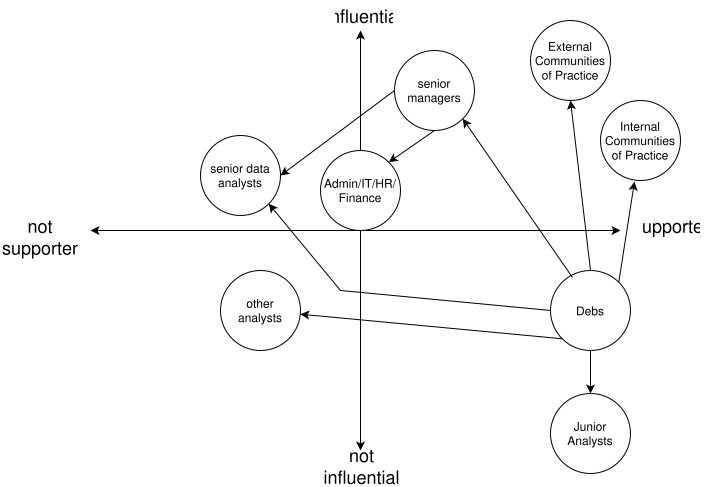

# Power

figuring out who has it and how to influence them

## Selectorate Theory

-   Most research organizations aren't democracies
    -   Faculty and students don't elect the university president
-   [[Bueno2022](b:Bueno2022)] explores how dictators stay in power
    -   [Nominal selectorate](g:nominal-selectorate): those who have the right to have a say
    -   [Real selectorate](g:real-selectorate): those who actually cast a vote
    -   [Winning coalition](g:winning-coalition): those whose votes produce victory
-   It is meant to be humorous—lab directors and funding officers aren't dictators—but their insights are widely applicable:
    1.  The smaller the winning coalition, the fewer people the person in charge needs to satisfy to remain in control.
    1.  The larger the selectorate, the easier it is to replace dissenters.
    1.  Extract as much as you can without provoking rebellion or recession.
    1.  Give your essential supporters just enough rewards to keep them loyal.
    1.  Do not reward them too well or they will become a threat.

<section class="exercise" markdown="1">

### Exercise: Who's in Charge?

1.  Who makes funding and work allocation decisions in your institution in theory?
1.  Who do they need to keep happy, and how do they do this?

This can be helpful later, to create strategy and tactics based on what the change can offer that helps them keep people happy.
</section>

## Power Mapping

-   Graphical tool to identify people to target and how to reach them
-   Steps:
    1.  Identify the (specific) people who can actually make the change you want.
    2.  Plot where (you believe) they stand on the issue (two axes).
    3.  Add people who can directly influence the people you identified in step 1.
    4.  Repeat step 3 for the people you just added until you are part of the diagram.

  

Many people find power mapping uncomfortable,
particularly if their map includes people who are also in the room.
This discomfort is one of the reasons things don't get better:
thinking consciously about how to change people's minds
makes compassionate people squeamish
(and feels much riskier than sequencing genomes).

But if we don't do it,
it will be done by people whom it *doesn't* make uncomfortable.
Both sociopaths and large organizations exist for the sole purpose of satisfying self-centered goals,
and neither feels empathy,
so it's not surprising that the former tend to do well in the latter.
While Edmund Burke never actually said,
"The only thing necessary for evil to triumph is for good men to do nothing,"
we owe it to those who fought to make our lives better to do the same.

<section class="exercise" markdown="1">

### Exercise: Power Mapping

1.  Pick a small but desirable change in your local environment and create a power map for it.
1.  Alternatively, translate the description of Debs' environment below into a power map.

</section>

## Debs' Power Map

As Debs begins thinking about how to introduce a more participatory way of running the community, she identifies the people and groups who are most likely to influence the outcome.

- *Senior managers* support communities of practice in principle but want evidence that giving members more responsibility will improve engagement and deliver value to the organisation.
- *Administration, HR, IT, and Finance* are generally supportive of communities but are primarily concerned with making sure any new governance arrangements are practical, sustainable, and fit existing organisational processes.
- *The other senior data analysts* have become cynical about the community because previous attempts to improve it never lasted. They are respected by their colleagues, however, and their support would help give the proposed changes credibility.
- *Other analysts* see the community as something they attend occasionally rather than something they own. Many are open to becoming more involved if they believe their contributions will genuinely influence the direction of the community.
- *Junior analysts* are enthusiastic about learning from others and developing professionally, but are often hesitant to volunteer for leadership roles without encouragement or clear expectations.
- *Internal communities of practice* have experience building engaged communities and are willing to share ideas about governance, participation, and sustaining volunteer contributions.
- *External communities of practice* provide examples of successful community governance and can demonstrate that shared ownership leads to stronger, more resilient communities.

